# Guía de Instalación del dashboard en Raspberry Pi

> Esta guía parte del supuesto de que ya está conectado a la Raspberry Pi mediante SSH o que estás trabajando directamente desde la terminal.

La instalación del proyecto está configurada para realizarse mediante la ejecución de un solo script. Este script contempla la instalación de algunos paquetes externos necesarios para el proyecto, así como la ejecución de los scripts requeridos.

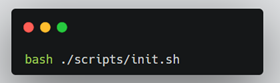

A continuación, se detallan los pasos que realiza el script de instalación, en caso de que se desee ejecutar manualmente o simplemente conocer los paquetes a instalar y los scripts involucrados.

Primero, se descarga y ejecuta el script de instalación de **nvm** (Node Version Manager) desde su repositorio oficial en GitHub.  
**nvm** es una herramienta que facilita la instalación, actualización y administración de versiones de Node.js, necesarias para la ejecución del servidor del proyecto.

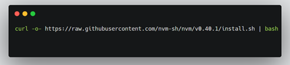

Luego, se configuran las variables de entorno necesarias para que **nvm** funcione correctamente en la terminal, asegurando que sus comandos estén disponibles en la sesión actual del shell.

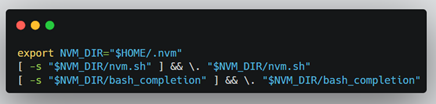

Este comando utiliza **nvm** para descargar e instalar la versión 18 de Node.js, que es la requerida por el proyecto. Sin embargo, también es posible seleccionar otra versión si se desea.  
A continuación, se debe usar el comando correspondiente para seleccionar la versión a utilizar.

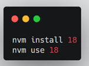

El siguiente paso es crear los archivos de entorno para el **dashboard**.  
En estos archivos se definen valores como la URL del servidor y el intervalo de tiempo en el que cada foto es tomada.  
Para ello, se debe acceder a la carpeta del dashboard, crear el archivo y editarlo agregando los valores mostrados en la imagen de la derecha.

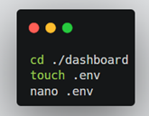  
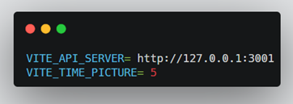

Se debe realizar el mismo procedimiento, pero esta vez para el **servidor**.

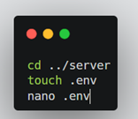  
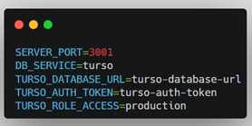

Ahora, es necesario tener un entorno de ejecución de Python para correr el proyecto.  
Para esto, primero se instala el paquete `python3-venv` en caso de que aún no esté instalado.

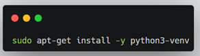

Una vez finalizada la instalación, se crea el entorno virtual e instalan las dependencias del proyecto.

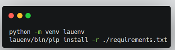

A continuación, se listan los paquetes a instalar manualmente si se prefiere hacerlo uno por uno:

- croniter  
- google-api-python-client  
- nest-asyncio  
- opencv-python  
- request  
- ultralytics  
- ultralytics-thop  
- websockets  
- numpy

Después de esto, se instalan las dependencias del **servidor**.

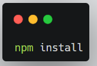

A continuación, se hace lo mismo con el **dashboard**, y además se realiza la exportación del mismo.

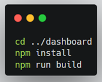

En este punto, ya se tiene todo listo para ejecutar el dashboard, el servidor y el modelo de detección.  
Sin embargo, es necesario utilizar un gestor de procesos para monitorear la ejecución del proyecto y manejar los procesos que se crean.  
Para ello, se utiliza **PM2**.  
Con el siguiente comando se instala la herramienta, se ejecuta el proyecto y se define la configuración para que se inicie automáticamente en caso de que la Raspberry se reinicie.

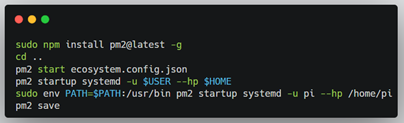

Después de un momento, el proyecto estará disponible para su uso.  
Puedes acceder al dashboard desde el navegador utilizando la siguiente URL:  
**http://localhost:5173**

En cuanto al modelo, se ejecutará un script que tomará fotos periódicamente. Estas serán procesadas por el modelo y su predicción final será guardada para poder visualizarla en el dashboard.
